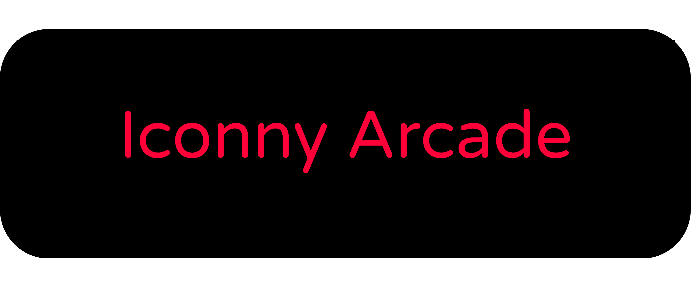

# 

### The browser open source for gamers

## Official Website
### https://techappssv.github.io/iconnybrowser/html/arcade.html
## Latest Version Stable
### https://github.com/TechAppsSv/iconny-arcade/releases

#
## Snap Version

#### Iconny Arcade is the version gamer from the Iconny Project 
#### This browser is based in Iconny LTS

## Iconny Arcade Features
### Always in Incognito
#### Iconny is made so that your history is not saved but without losing your information when closing the browser
### Ad blocker
#### Iconny has a built-in ad blocker
### Notely
#### Thanks to the Iconny code, Notely has a very basic system of notes and that if these are links you can open them all saved in LocalStorage

### MonocroX 2
#### Monocrox is a new interface for Iconny Arcade designed for Big screens and reduce eyestrain and more basic and fast all based in Monocromatix

### Fast and Light
#### Iconny Arcade is more fast than other versions

### OneTab
#### Is the option specially designed for use with playing reducing the resource consumption

### WindowApps
#### Apps Webs in windows for helping the productivity

### Multi platform
#### Iconny is present on the two main platforms Linux and Windows

#
#### Last Update of this document
##### December 28, 2021

